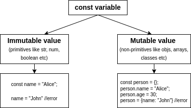

# Constants declared with const

A variable declared with `const` can be mutable or immutable depending on the data type of the assigned value. However, a constant cannot be reassigned to a new value.

The difference between assignment and immutability (mutability) is:

- The *assignment* has to do with variable bindings, binding a name to a piece of data.
- *Immutability* (mutability) is a property that belongs to the actual data that the binding contains. All primitives (strings, numbers, and so on) are immutable, whereas objects are mutable.

To summarize, when we say constants are immutable, we mean that once a primitive value is assigned to a constant, it cannot be changed. And when we say constants are not immutable, we mean that we can change the properties of the non-primitive values like objects, arrays, etc.